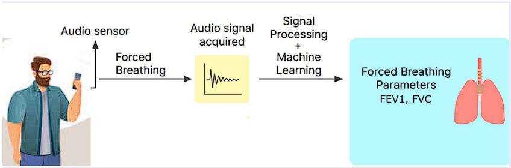
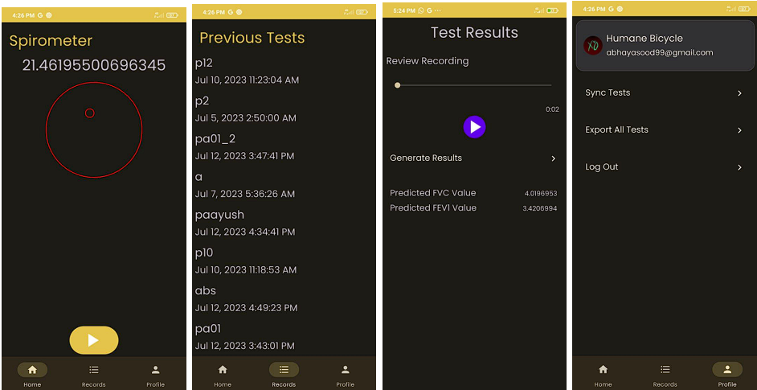

# Audio Spirometer on Android

## Abstract
This research focused on the development of an Android application for finding the
two important lung parameters, FEV1 and FVC using the Android smartphone.
The integration of a dataset collected from a [previous study](https://rishi-a.github.io/downloads/publications/spiromask.pdf) 
by [Rishiraj Adhikary](https://rishi-a.github.io/) provided is used for analysis. By applying feature extraction, audio-based 
features were generated from the collected data. 

## Key Work Includes
1. An Android application that uses a random forest classifier to predict the
lung parameters, FEV1 and FVC.
2. The application can also record other features like the orientation of the
device, and information about a person such as age, weight, height, and
gender, and export the information to a CSV file for further data analysis.
3. Provides visual feedback for each maneuver, thus making it easier to record
maneuvers.

# Methodology

## Feature Extraction:

Several features from the audio were initially taken such as the
MFCC(Mel-frequency cepstral coefficients), Spectrogram (STFT or Short
time Fourier Transform), MFC(Mel-frequency cepstral coefficients),
Spectral Features, and Temporal Features. Still, according to the paper,
High-Resolution Time-Frequency Spectrum-Based Lung Function Test from
a Smartphone Microphone, a 12% error was observed when STFT features
were used. They were also easier to extract and implement on Android, so
we decided to continue with STFT features. They are generated using the
Librosa library and flattened so that a random forest model can be trained.

## Model Training

The STFT features are a 2d matrix of complex numbers. We flattened the
matrix by taking the mean of the rows to train a random forest. Random
Forest classifier from Scikit learn library was used to train the model. The
extracted features from the audio are used to train the model and its
performance is evaluated using the LOOCV technique.

## Android Implementation

To make sure the model runs on Android devices, Open Neural Network
Exchange(ONNX) was used. The model was first trained and then exported
to ONNX format using the library skl2onnx. The ONNX is then converted to
ort format and then run using ONNX Runtime on the Android device.
A very useful article explaining this entire process is given. This article was
also used to run the model on Android devices

The converted ORT model into an Android application, allowing
real-time classification of audio inputs captured by the device's audio sensor.
Extract the features from the Java equivalent library of librosa, called
jLibrosa, flatten the output, and feed its output to the model. The FEV1 and
FVC can then be predicted.

It is important to ensure that the audio is recorded with the same parameters
used to record the data in the study. This ensures that the audio on which the
model is trained is the same as that on the model.

[This article](https://towardsdatascience.com/deploying-scikit-learn-models-in-android-apps-with-onnx-b3adabe16bab) was really helpful in the above process

# Visual Feedback

One of the biggest aspects of the project was to provide user feedback on
the forced maneuver. Visual feedback was given on:
1. Orientation
How the orientation of the phone should be. Keeping the phone at an
angle where the maneuver was best recorded. It was decided to be
between 28 to 32 degrees from the horizontal plane.
2. Acceleration of device.
The acceleration of the device was recorded during the breathing
maneuver. This is recorded in the test and can be exported from the
app.

Accuracy of the model on the dataset:
The model performed fairly accurately with mean absolute percentage errors of
6.05% for FEV1 and 5.77% for FVC respectively.

# THIS REPOSITORY
1. [android_app](android_app/) contains the android app. 
2. [deployed_model](deployed_model/) contains the versions of deployed models
3. [methodology](methodology/) contains the Method, Model and the data used to train the model.

References
1. Adhikary, Rishiraj & Lodhavia, Dhruvi & Francis, Chris & Patil, Rohit &
Srivastava, Tanmay & Khanna, Prerna & Batra, Nipun & Breda, Joe &
Peplinski, Jacob & Patel, Shwetak. (2022). SpiroMask: Measuring Lung
Function Using Consumer-Grade Masks.
2. Thap, T.; Chung, H.; Jeong, C.; Hwang, K.-E.; Kim, H.-R.; Yoon, K.-H.;
Lee, J. High-Resolution Time-Frequency Spectrum-Based Lung Function
Test from a Smartphone Microphone. Sensors 2016, 16, 1305.
https://doi.org/10.3390/s16081305
3. Eric C. Larson, Mayank Goel, Gaetano Boriello, Sonya Heltshe, Margaret
Rosenfeld, and Shwetak N. Patel. 2012. SpiroSmart: using a microphone to
measure lung function on a mobile phone. In Proceedings of the 2012 ACM
Conference on Ubiquitous Computing (UbiComp '12). ACM, New York,
NY, USA, 280-289. DOI=http://dx.doi.org/10.1145/2370216.2370261
4. [Deploying Scikit-Learn Models In Android Apps With ONNX by Shubham
Panchal](https://towardsdatascience.com/deploying-scikit-learn-models-in-android-apps-with-onnx-b3adabe16bab)
